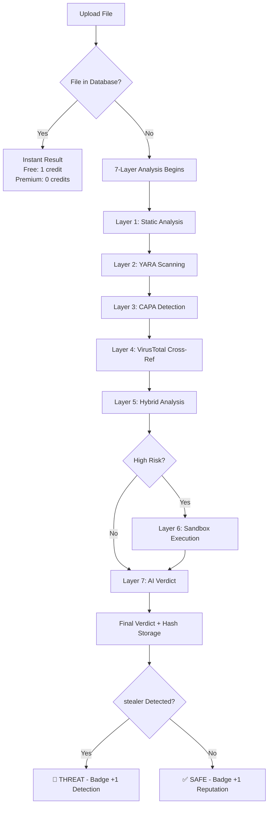

# Vortex-discord-security-
<div align="center">


<br/>


&nbsp;

&nbsp;

&nbsp;


</div>

<br/>

---

## 🎯 What is Vortex?

<div align="center">

**Vortex** is a specialized **Discord Malware & token stealer detection platform** built from the ground up to identify malicious token stealers with surgical precision. Unlike traditional antivirus solutions that flag everything suspicious, Vortex uses **dynamic behavioral analysis** to distinguish between legitimate tools (game cheats, mods, trainers) and actual Discord token theft malware.

```
⚡ THIS IS NOT A TOKEN stealer — IT DETECTS THEM ⚡
```

</div>

### ✨ Why Vortex is Different

<table>
<tr>
<td width="50%">

**🔬 Traditional Antivirus**
```diff
- Flags game cheats as malware
- High false positive rate
- Generic threat detection
- No Discord-specific analysis
- Pattern-based only
```

</td>
<td width="50%">

**⚡ Vortex Detection Engine**
```diff
+ Ignores legitimate game tools
+ ~2% false positive rate
+ Token stealer specialized
+ Discord behavior profiling
+ Multi-layer dynamic analysis
```

</td>
</tr>
</table>

---

## 🛡️ Core Features

<div align="center">

<table width="100%">
<tr>
<td width="50%" valign="top">

### 🔍 **7-Layer Analysis Engine**


Every file goes through **7 independent analysis layers** before final verdict. Each layer specializes in different threat indicators.

</td>
<td width="50%" valign="top">

### 💎 **Smart Scanning System**

**Free Tier**
- ✅ 5 scans per day
- ✅ Full 7-layer analysis
- ✅ Badge progression
- ✅ Leaderboard ranking
- ✅ Resets midnight IST

**Premium Credits**
- ✅ Unlimited scanning
- ✅ 0 credits for cached files
- ✅ Priority queue
- ✅ First-discovery attribution

</td>
</tr>
</table>

</div>

---

## 🏆 Gamification System

<div align="center">

<table>
<tr>
<td align="center" width="33%">

### 🎖️ **Badge System**

**Analyst Track** (Reputation)
```
Novice Archivist → Data Collector
Digital Hoarder → Archive Guardian
Vault Keeper → Master of Archives
```

**Hunter Track** (Detections)
```
Threat Spotter → Stealer Hunter
Malware Slayer → stealer Exterminator
Discord Purifier
```

</td>
<td align="center" width="33%">

### 📊 **Leaderboards**

**Three Rankings**
- 🔥 Reputation Rank
- 🎯 stealer Detection Rank
- 🏅 Total Badges Rank

Real-time global standings with automatic badge awards on milestone completion.

</td>
<td align="center" width="33%">

### 📈 **Reputation System**

**Earn Points By:**
- Completing scans
- Finding new threats
- First-discovery bonus
- Premium contributions

Track your impact on the global threat database.

</td>
</tr>
</table>

</div>

---

## 🔬 Analysis Methods Explained

<div align="center">

| Method | What It Does | When Used |
|--------|-------------|-----------|
| **Static Analysis** | Examines file without execution | All files |
| **YARA Rules** | Pattern matching for known stealer signatures | Executables |
| **CAPA** | Capability detection (registry, network, Discord paths) | PE files |
| **VirusTotal** | Cross-reference with 70+ antivirus engines | New files |
| **Hybrid Analysis** | Cloud-based behavioral sandbox | Suspicious files |
| **Dynamic Sandbox** | Controlled execution monitoring | High-risk files |
| **AI Verdict** | Machine learning final decision | All scans |

</div>

### 📦 Special: Archive Handling

```
RAR/ZIP → Scan archive integrity first
    ↓
 If SAFE → Extract and scan contents individually
    ↓
 If SUSPICIOUS → Flag without extraction (prevents payload detonation)
```

- **Supported formats**: EXE, DLL, RAR, ZIP, 7Z, TAR, GZ, and 40+ more file types
- **Hash tracking**: Every file hash saved to global database
- **Duplicate detection**: Instant results for previously scanned files

---

## ⚠️ CRITICAL SAFETY INFORMATION

<div align="center">

### 🚨 THIS TOOL IS NOT A TOKEN stealer

**Vortex DETECTS stealers — it is NOT one itself.**

However, to perform **dynamic behavioral analysis** (Sandbox method), Vortex must execute files in a controlled environment. This is **why you MUST use a VM**.

</div>

### ✅ Safe Usage Protocol

<table>
<tr>
<td width="50%">

**🟢 Required Setup (MANDATORY)**

```yaml
Environment : Virtual Machine (VMware/VirtualBox)
Discord App : MSI App Player with FAKE account
Token      : Use throwaway/burner Discord account
Network    : Isolated or monitored VM network
Snapshot   : Create VM snapshot before scanning
```

</td>
<td width="50%">

**🔴 DO NOT**

```diff
- Run on your main system
- Use real Discord account in VM
- Scan files with real token logged in
- Ignore VM setup instructions
- Share config.json (contains API keys)
```

</td>
</tr>
</table>

<div align="center">

### ⚡ Why VM is MANDATORY

When Vortex runs **Sandbox analysis**, it **executes the file** to observe behavior. If the file IS a token stealer and you're running Vortex on your **main machine** with your **real Discord account logged in**, the stealer WILL steal your token.

**VM Setup Guide**: [Complete VM Configuration Instructions](https://vortex-guide-chi.vercel.app/#setup)

</div>

---

## 📥 Download & Installation

<div align="center">

### 🎯 Official Sources ONLY

<a href="https://vortex-guide-chi.vercel.app/#download">
  
</a>
&nbsp;&nbsp;
<a href="../../releases">
  
</a>

<br/><br/>

**Full Documentation**: [vortex-guide-chi.vercel.app](https://vortex-guide-chi.vercel.app)

</div>

### 📋 Quick Start

```bash
# 1. Download Vortex.exe from official sources
# 2. Set up VM with Discord (fake account)
# 3. Run Vortex.exe inside VM
# 4. Create account (no VPN during registration)
# 5. Configure API keys (VirusTotal, Hybrid Analysis, OpenRouter)
# 6. Start scanning files
```

**⚠️ Important**: The tool requires **Discord to be running** during scans for behavioral monitoring. Use a **burner account** in your VM.

---

## 🎓 How It Works

<div align="center">



</div>

---

## 📊 Accuracy & Performance

<div align="center">

<table>
<tr>
<td align="center">

### 🎯 Detection Metrics

```
True Positive Rate:  ~98%
False Positive Rate: ~2%
Tested on:          10,000+ samples
Specialization:     Discord token stealers
```

</td>
<td align="center">

### ⚡ Performance

```
Cached Files:    <1 second
New Executables: 3-20 minutes
Large Files:     Up to 30 minutes
Archive Scan:    Varies by size
```

</td>
</tr>
</table>

</div>

### ✅ What's Considered SAFE

- **Game cheats** and trainers (unless they contain token stealers)
- **Modded clients** for games
- **Automation tools**
- **Cracked software** (malware-free)
- **Custom executables** without Discord theft behavior

**Vortex won't flag your GTA V mod menu or Valorant skin changer** — unless they're hiding a token stealer.

---

## 🔐 Privacy & Security

<div align="center">

<table width="100%">
<tr>
<td width="50%">

**🛡️ What Vortex Collects**

```yaml
Account:
  - Username (changeable)
  - Hardware ID (device binding)
  - IP address (registration + anti-VPN)

Scans:
  - File hash (SHA-256)
  - Scan timestamp
  - Verdict result
  - Layer outputs (anonymous)
```

</td>
<td width="50%">

**🔒 What Vortex Protects**

```yaml
Security:
  - API keys encrypted locally
  - Hardware-locked accounts
  - VPN allowed post-registration
  - No file content stored
  - Debugger = instant ban

Files:
  - Only hash stored permanently
  - Metadata for analysis
  - No file re-distribution
```

</td>
</tr>
</table>

</div>

---

## 🌐 Community & Support

<div align="center">

<a href="https://discord.gg/yVejV6W5aD">
  
</a>
&nbsp;&nbsp;
<a href="https://vortex-guide-chi.vercel.app">
  
</a>
&nbsp;&nbsp;
<a href="../../issues">
  
</a>

<br/><br/>

### 📬 Get Help

| Topic | Where to Ask |
|-------|-------------|
| **Setup Issues** | Discord Server → #support |
| **False Positive Report** | GitHub Issues |
| **Feature Requests** | Discord Server → #suggestions |
| **Account Problems** | Discord DM to @blaze0089 |

</div>

---

## ⚖️ Legal & Ethics

<div align="center">

### ⚠️ Authorized Use Only

```
This tool is designed for:
  ✅ Analyzing files you own or have permission to scan
  ✅ Educational and research purposes
  ✅ Personal device security auditing
  ✅ Community threat intelligence sharing

This tool is NOT for:
  ❌ Scanning files without authorization
  ❌ Reverse engineering proprietary software
  ❌ Distributing or sharing malware samples
  ❌ Bypassing anti-cheat or DRM systems
```

**The creator is not responsible for misuse.** Use responsibly and legally.

</div>

---

## 📜 FAQ

<details>
<summary><b>Is Vortex itself a token stealer?</b></summary>

**NO.** Vortex **detects** token stealers — it is not one. However, it executes files in a Sandbox to analyze behavior, which is why you **must use a VM with a fake Discord account**.

</details>

<details>
<summary><b>Why do I need to run Discord with a fake account?</b></summary>

Vortex monitors Discord process behavior during Sandbox analysis. If the scanned file attempts to interact with Discord (token theft, webhook injection, etc.), Vortex catches it. Use a **burner/fake account** so if a file IS malicious, it steals a worthless token.

</details>

<details>
<summary><b>Will my game cheats be flagged?</b></summary>

**No** — unless they contain token-stealing functionality. Vortex is trained to ignore legitimate game modifications, trainers, and cheats. Traditional AVs flag these; Vortex doesn't.

</details>

<details>
<summary><b>Can I get banned for using Vortex?</b></summary>

**Discord cannot detect Vortex usage.** However, attaching a debugger to Vortex results in an **instant permanent account ban** (no appeal).

</details>

<details>
<summary><b>How are duplicates handled?</b></summary>

If a file's hash exists in the database:
- **Free users**: Still uses 1 daily scan credit
- **Premium users**: Costs 0 credits, instant result

</details>

<details>
<summary><b>What happens if I scan a RAR/ZIP?</b></summary>

```
Step 1: Vortex scans the archive container itself
Step 2: If SAFE → Extract and scan each file inside
Step 3: If SUSPICIOUS → Flag immediately without extraction
```

This prevents accidental execution of packed malware payloads.

</details>

---

## 🏗️ Technical Stack

<div align="center">

```
Analysis Engine:  Python 3.11+
Static Analysis:  YARA, CAPA, PEfile
Dynamic Analysis: Custom Sandbox (Windows VM)
AI/ML Engine:     OpenRouter API (Claude/GPT models)
Cross-Reference:  VirusTotal API, Hybrid Analysis API
Database:         PostgreSQL (hash storage)
Frontend:         Custom GUI (Electron-based)
Backend:          FastAPI + WebSockets
```

</div>

---

## 📈 Roadmap

<div align="center">

| Feature | Status | ETA |
|---------|--------|-----|
| **Linux Support** | 🔄 Planned | Q2 2025 |
| **macOS Support** | 🔄 Planned | Q3 2025 |
| **Browser Extension Scanning** | 🔄 Planned | Q2 2025 |
| **Mobile App (Android/iOS)** | 💭 Considering | TBD |
| **Custom YARA Rule Upload** | 💭 Considering | TBD |
| **Public API Access** | 🔒 Premium Only | Q4 2025 |

</div>

---

## 🙏 Credits & Attribution

<div align="center">

**Built by**: [blaze0089](https://github.com/blaze0089)  
**Powered by**: VirusTotal, Hybrid Analysis, OpenRouter, YARA, CAPA  
**Community**: Discord Server Contributors

Special thanks to everyone who reported false positives and helped improve detection accuracy.

</div>

---

## 📄 License

<div align="center">

**Proprietary Software — All Rights Reserved**

This is **closed-source commercial software**. The executable is provided for personal use under the terms outlined in the [Guide Site](https://vortex-guide-chi.vercel.app).

- ✅ Personal use allowed
- ✅ Scanning your own files
- ❌ Redistribution prohibited
- ❌ Reverse engineering prohibited (instant ban)
- ❌ Commercial use without license

</div>

---

<div align="center">

### 🔥 Stay Protected

**Scan smarter. Detect faster. Stay ahead of token stealers.**

<br/>


<br/><br/>


</div>
 
